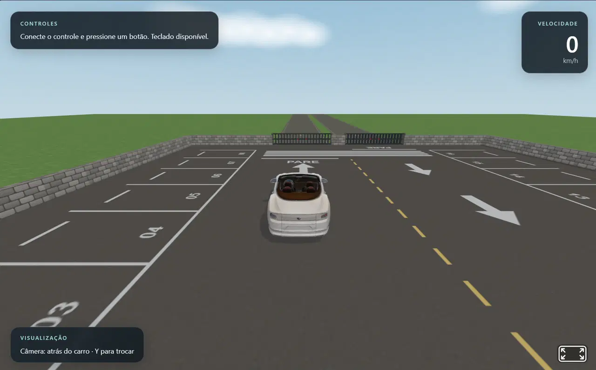

# Mini Driving Simulator 3D

[](https://www.blender.org/)
[](https://aframe.io/)
[](https://threejs.org/)
[](https://www.khronos.org/gltf/)
[](https://developer.mozilla.org/en-US/docs/Web/JavaScript)
[](https://developer.mozilla.org/en-US/docs/Web/API/Gamepad_API)

[](https://github.com/lianeheidemann/mini-driving-simulator-3d/actions/workflows/html-validate.yml)
[](https://github.com/lianeheidemann/mini-driving-simulator-3d/actions/workflows/deploy-pages.yml)

A browser-based 3D driving simulator built with **[Blender](https://www.blender.org/)**, **[A-Frame](https://aframe.io/)**, and **[Three.js](https://threejs.org/)**, drivable with the keyboard or an Xbox-compatible gamepad.



**🎮 Try it live: https://lianeheidemann.github.io/mini-driving-simulator-3d/**

## Overview

Load a car model exported from Blender into a small parking-lot scene and drive it around with arcade-style handling: acceleration, braking/reverse, steering, a handbrake, wall collisions with recoil, a live speedometer, and two camera modes.

## Features

- Keyboard and Gamepad API input, auto-detected at runtime.
- Arcade vehicle physics: acceleration, braking, reverse, drag, and speed-sensitive steering.
- Collision handling against the parking-lot boundary walls, with impact recoil and camera shake.
- Two camera modes: chase camera and top-down overhead view, with smooth transitions.
- HUD with connected-controller status, live speedometer (km/h), and camera mode indicator.
- Procedurally laid out scenery: stone boundary walls, gated entrance, parking markings, and surrounding landscape.
- Vehicle reset to the starting position/orientation at any time.

## Tech stack

| Technology | Role in the project |
| --- | --- |
| [Blender](https://www.blender.org/) | Creates and prepares the car and any other 3D assets. |
| [glTF / GLB](https://www.khronos.org/gltf/) | Format used to export 3D models from Blender to the browser. |
| [A-Frame](https://aframe.io/) | HTML-like structure for the 3D scene, entities, and custom components. |
| [Three.js](https://threejs.org/) | Lower-level access to vectors, quaternions, and custom per-frame logic (used through A-Frame). |
| [Gamepad API](https://developer.mozilla.org/en-US/docs/Web/API/Gamepad_API) | Reads an Xbox-compatible controller's sticks, triggers, and buttons. |

## Controls

| Action | Keyboard | Gamepad |
| --- | --- | --- |
| Steer | A/D or ←/→ | Left stick |
| Accelerate | W or ↑ | Right trigger (RT) |
| Brake / reverse | S or ↓ | Left trigger (LT) |
| Handbrake | Space | A |
| Reset vehicle | R | B |
| Toggle camera | Y | Y |

The gamepad is read through the standard [`navigator.getGamepads()`](https://developer.mozilla.org/en-US/docs/Web/API/Navigator/getGamepads) mapping; connect a controller and press any button to activate it.

## Getting started

The project is a static site with no build step, but the browser's `file://` origin blocks glTF/texture loading, so serve it over HTTP:

```bash
python -m http.server 8000
```

Then open:

```text
http://localhost:8000
```

## Project structure

```text
mini-driving-simulator-3d/
├── doc/
│   └── step-by-step/              # Learning-oriented guides for the stack
│       ├── README.md
│       ├── 05-integration-guide.md
│       └── archive/               # Earlier, superseded guides (Blender, A-Frame, Three.js, gamepad)
├── input/                        # Source 3D assets (.glb / .blend)
├── src/
│   ├── components/                # A-Frame components
│   │   ├── vehicle-controller.js  # Driving physics, collisions, reset
│   │   ├── follow-camera.js       # Chase and overhead camera modes
│   │   └── scenery.js             # Walls, ground, landscape, sky
│   └── controls/
│       └── gamepad-input.js       # Gamepad API -> logical driving input
├── index.html                    # Scene entry point
├── LICENSE
└── README.md
```

## Documentation

The [doc/](doc/) folder has the step-by-step guides used while building this project:

- [Complete integration guide](doc/step-by-step/)

## Roadmap

The core loop (load car, drive, collide, reset, follow camera) is done. Possible next steps:

- [ ] Wheel rotation and front-wheel steering animation.
- [ ] Connect non-Xbox controllers through [InputMapper](https://apps.microsoft.com/detail/9mzxvnfhgdw7?hl=en-US&gl=PT) (XInput emulation).
- [ ] Checkpoints and a lap timer.
- [ ] Engine audio.

## Contributing

Contributions are welcome — see [CONTRIBUTING.md](CONTRIBUTING.md) for local setup, project structure, and the PR process.

## License

Distributed under the [MIT License](LICENSE).
