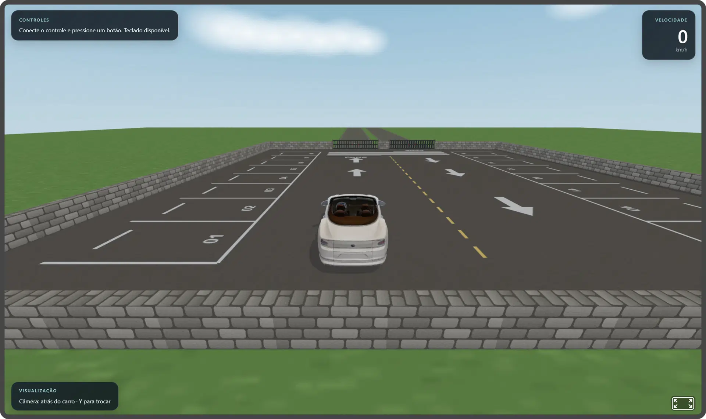
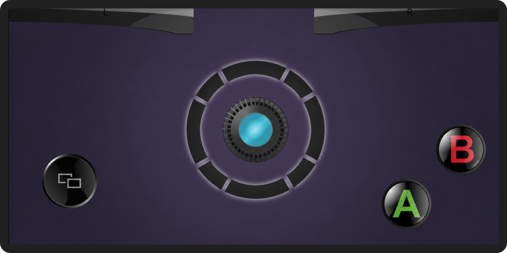

# Mini Driving Simulator 3D

[](https://www.blender.org/)
[](https://aframe.io/)
[](https://threejs.org/)
[](https://www.khronos.org/gltf/)
[](https://developer.mozilla.org/en-US/docs/Web/JavaScript)
[](https://developer.mozilla.org/en-US/docs/Web/API/Gamepad_API)

[](https://github.com/lianeheidemann/mini-driving-simulator-3d/actions/workflows/html-validate.yml)
[](https://github.com/lianeheidemann/mini-driving-simulator-3d/actions/workflows/deploy-pages.yml)

A browser-based 3D driving simulator built with **[Blender](https://www.blender.org/)**, **[A-Frame](https://aframe.io/)**, and **[Three.js](https://threejs.org/)**, drivable with the keyboard or an Xbox-compatible gamepad.



**👾 Try it live: https://lianeheidemann.github.io/mini-driving-simulator-3d/**

## Overview

The car's initial 3D model was generated with [Tripo3D](https://www.tripo3d.ai/) and prepared in Blender for use in the simulator. Drive it around a small parking-lot scene with arcade-style handling: acceleration, braking/reverse, steering, a handbrake, wall collisions with recoil, a live speedometer, and two camera modes.

## Features

- Keyboard and Gamepad API input, auto-detected at runtime.
- Arcade vehicle physics: acceleration, braking, reverse, drag, and speed-sensitive steering.
- Collision handling against the parking-lot boundary walls, with impact recoil and camera shake.
- Two camera modes: chase camera and top-down overhead view, with smooth transitions.
- HUD with connected-controller status, live speedometer (km/h), and camera mode indicator.
- Procedurally laid out scenery: stone boundary walls, gated entrance, parking markings, and surrounding landscape.
- Vehicle reset to the starting position/orientation at any time.

## Tech stack

| Technology | Role in the project |
| --- | --- |
| [Tripo3D](https://www.tripo3d.ai/) | Generated the initial 3D car model. |
| [Blender](https://www.blender.org/) | Prepares the 3D model and other assets for use in the simulator. |
| [glTF / GLB](https://www.khronos.org/gltf/) | Format used to export 3D models from Blender to the browser. |
| [A-Frame](https://aframe.io/) | HTML-like structure for the 3D scene, entities, and custom components. |
| [Three.js](https://threejs.org/) | Lower-level access to vectors, quaternions, and custom per-frame logic (used through A-Frame). |
| [Gamepad API](https://developer.mozilla.org/en-US/docs/Web/API/Gamepad_API) | Reads an Xbox-compatible controller's sticks, triggers, and buttons. |

## Controls

| Action | Keyboard | Gamepad |
| --- | --- | --- |
| Steer | A/D or ←/→ | Either stick or D-pad |
| Accelerate | W or ↑ | RT (analog) or RB (digital) |
| Brake / reverse | S or ↓ | LT (analog) or LB (digital) |
| Handbrake | Space | A |
| Reset vehicle | R | B |
| Toggle camera | Y | Y or DroidJoy screen button (`8`) |

The gamepad is read through the standard [`navigator.getGamepads()`](https://developer.mozilla.org/en-US/docs/Web/API/Navigator/getGamepads) mapping; connect a controller and press any button to activate it.

For touch controllers, **RB also accelerates, LB also brakes/reverses, and the D-pad can steer**. These digital alternatives reproduce the immediate response of the keyboard while RT/LT and either virtual stick remain available for analog control. Moving the stick left replaces holding `A`; moving it right replaces holding `D`, including while accelerating.

### DroidJoy Xbox emulation

With **Activate XInput gamepad** enabled, DroidJoy creates a virtual Xbox/XInput-compatible controller in Windows. The input path is:

```text
Phone -> DroidJoy Server -> virtual XInput controller -> browser Gamepad API -> game
```

The numbers displayed by DroidJoy configure the phone controls; they are not keyboard keys. When the browser reports `mapping: "standard"`, it converts them to the standard Gamepad API indices automatically:

| Control | DroidJoy number | Standard browser index | Game action |
| --- | ---: | ---: | --- |
| A | `1` | `buttons[0]` | Handbrake |
| B | `2` | `buttons[1]` | Reset vehicle |
| Y | `4` | `buttons[3]` | Toggle camera |
| LB | `5` | `buttons[4]` | Brake / reverse (digital) |
| RB | `6` | `buttons[5]` | Accelerate (digital) |
| Screen / Start | `8` | `buttons[9]` | Toggle camera |
| LT | `11` | `buttons[6]` | Brake / reverse |
| RT | `12` | `buttons[7]` | Accelerate |

For a more comfortable DroidJoy touch layout, use the wide shoulder controls as digital pedals: LB=`5` brakes/reverses and RB=`6` accelerates. This is an additional mapping; LT=`11` and RT=`12` continue to work.

#### Custom DroidJoy Lite layout



| Visible control | DroidJoy setting | Game action |
| --- | ---: | --- |
| Large center stick | Left or right virtual stick | Steer: left replaces keyboard `A`, right replaces `D` |
| `L` shoulder | `5` (LB) | Brake / reverse |
| `R` shoulder | `6` (RB) | Accelerate |
| A | `1` | Handbrake |
| B | `2` | Reset vehicle |
| Two-rectangles button | `8` (Screen / Start) | Toggle camera, like keyboard `Y` |

The stick and accelerator work simultaneously: keep one thumb on the stick while holding `R` with another finger. The game accepts the custom stick whether DroidJoy exposes it as the left or right Xbox stick.

If DroidJoy appears in the browser without a `standard` mapping, the game also supports its numbered fallback: A=`buttons[0]`, B=`buttons[1]`, Y=`buttons[3]`, LB=`buttons[4]`, RB=`buttons[5]`, screen button 8=`buttons[7]`, LT=`buttons[10]`, and RT=`buttons[11]`. Steering accepts the horizontal axis of either virtual stick (`axes[0]` or `axes[2]`).

## Getting started

The project is a static site with no build step, but the browser's `file://` origin blocks glTF/texture loading, so serve it over HTTP:

```bash
python -m http.server 8000
```

Then open:

```text
http://localhost:8000
```

## Project structure

```text
mini-driving-simulator-3d/
├── doc/
│   └── step-by-step/              # Learning-oriented guides for the stack
│       ├── README.md
│       └── archive/               # Earlier, superseded guides (Blender, A-Frame, Three.js, gamepad)
├── input/                        # Source 3D assets (.glb / .blend)
├── media/                        # Screenshots and controller-layout images used in the docs
├── src/
│   ├── components/                # A-Frame components
│   │   ├── vehicle-controller.js  # Driving physics, keyboard input, collisions/recoil, reset, boundary walls
│   │   ├── follow-camera.js       # Chase and overhead camera modes
│   │   └── scenery.js             # Stone walls, parking surface, exterior landscape, sky textures
│   └── controls/
│       └── gamepad-input.js       # Gamepad API -> logical driving input
├── index.html                    # Scene entry point
├── LICENSE
└── README.md
```

See the [Complete Integration Guide](doc/step-by-step/05-integration-guide.md#good-second-version-features) for the same list kept alongside the step-by-step docs.

## License

Distributed under the [MIT License](LICENSE).
